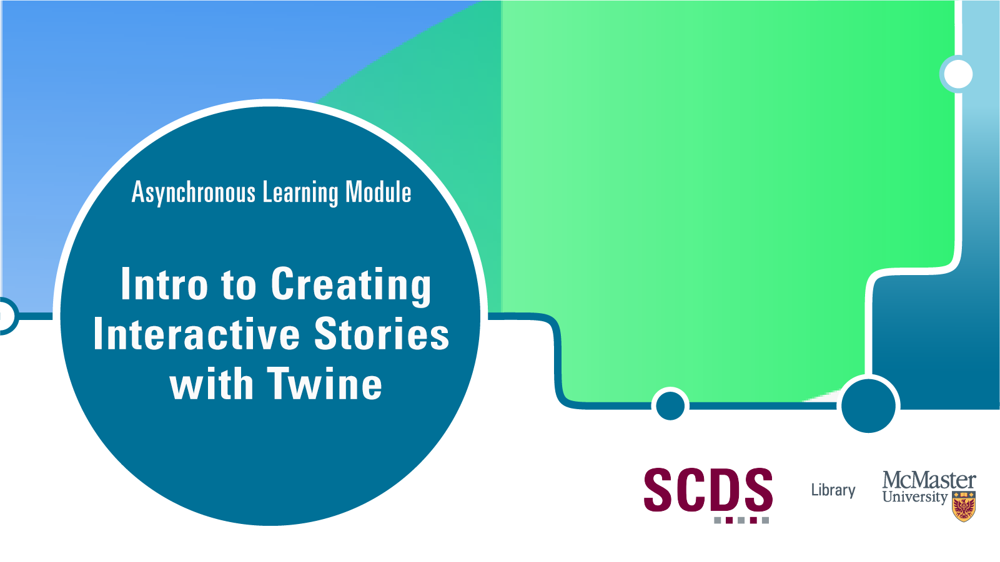

<!-- 
This will be the home page of your module. It should give a small introduction to the student about the workshop topic.
Add, edit, or remove any content below for the workshop in question. -->

<!-- Title slide image. Replace img src with your own, or comment this out. -->

<!-- Main header -->
# Introduction to Creating Interactive Stories with Twine

This module will introduce you to Twine, a beginner-friendly platform for building interactive fiction. We will discuss how to create a Twine game, how to customize it, and how to publish it online for others to see.

These tutorials were made for HUM2DH3: Creative, Collaborative, Critical: Introduction to Digital Scholarship. Sections of the videos relate directly to an assignment where students create a retelling of Frankenstein through a Twine Game. However, the majority of each video functions as a general introduction to Twine Games.

Asynchronous Tutorials by Veronica Litt, Digital Scholarship Coordinator. [Book an appointment with Veronica or another member of the Sherman Centre Team.](https://libcal.mcmaster.ca/appointments/)

## Prerequisites

<!-- If creating or installing is covered in the module (preparation), mention that in brackets. -->
- Installation of [Twine](https://twinery.org/) (this will be covered in the Preparation page)
- An [itch.io](https://itch.io/) account (this will be covered in the Preparation page)

<!-- What will the student learn to do, learn to use, etc. -->
## Learning Objectives
By the end of this workshop, you will be able to:
- Create an interactive digital story using [Twine](https://twinery.org/)
- Learn how to customize your game using Twine's built-in tools and code
- Publish your game on [itch.io](https://itch.io/)

<!-- Estimate the time the workshop will take to complete. Feel free to remove this. -->
## Duration
This module will take around 2 hours, however feel free to work at your own pace!

## Land Acknowledgement
McMaster University is situated in Ohròn:wakon which is the traditional territories of the Erie, Neutral, Huron-Wendat, Haudenosaunee and Mississaugas. This land is covered by the “Dish With One Spoon Wampum Belt Covenant”, an agreement between the Haudenosaunee confederacy and Anishinaabe nations to ensure those who live here take only what they need, leave enough in the dish for others, and keep the dish clean. This land is also covered by the Between the Lakes Treaty of 1792 and is very close to the 1784 Haldimand Treaty, which holds the land six miles to each side of the Grand River as a tract for Six Nations, which is currently not being honored. 

Many of us at the Sherman Centre took the First Nations' Information Governance Centre's OCAP course this past year which stands for Ownership, Control, Access, and Possession. We encourage you to learn [more about OCAP](https://fnigc.ca/ocap-training/take-the-course/) and Indigenous data management practices more broadly, including the [OCAS principles](https://u.mcmaster.ca/ocas-framework) endorsed by the Manitoba Métis Federation, the principles of [Inuit Qaujimajatuqangit](https://doi.org/10.1139/as-2020-0015), ᐃᓄᐃᑦ ᑕᐱᕇᑦ ᑲᓇᑕᒥ (Inuit Tapiriit Kanatami) [National Inuit Strategy on Research](https://www.itk.ca/national-strategy-on-research-launched/), and Global Indigenous Data Alliance’s [CARE principles](https://www.gida-global.org/care). 
