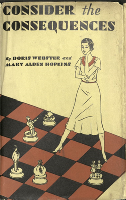
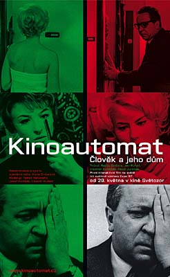
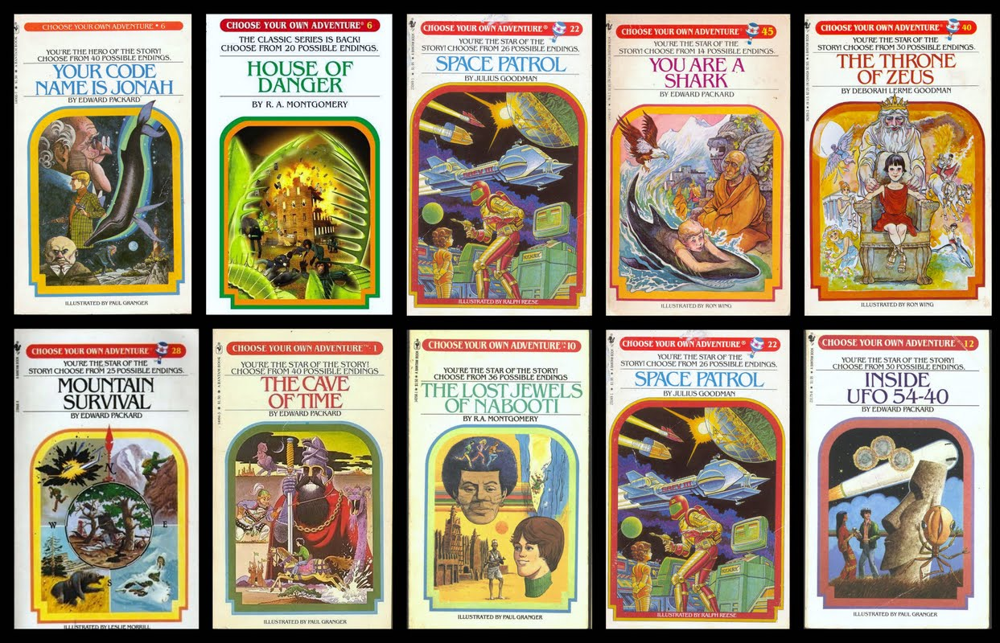
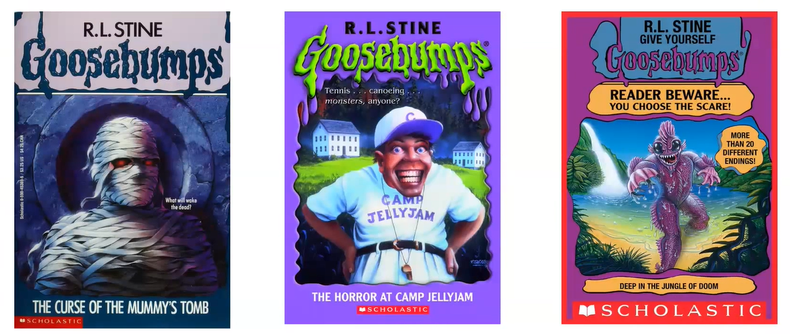

<!-- 
This page will go over introductory content to the workshop. 
If your workshop has an introduction sequence, whether it be history, "Why should you use __", or anything of that matter, this is where it goes! If your workshop doesn't need this, delete introduction.md from the repository. 
Add, edit, or remove any content below for the workshop in question. 
-->

# Workshop Introduction 
Follow along with the introductory video, slides, or text below.

<!-- If your page has a video to go along with it, put it here. -->
<iframe height="416" width="100%" allowfullscreen frameborder=0 src="https://echo360.ca/media/c387e1fe-8042-44d2-a114-3c50ef18c524/public"></iframe>
[View original here.](https://echo360.ca/media/c387e1fe-8042-44d2-a114-3c50ef18c524/public)

<!-- If your page has slides/PDFs/worksheets to go along with it, put it here. -->
<embed width="100%" height="466" src="assets/docs/twineIntro.pdf" style="border:none;">
[Download slides here.](assets/docs/twineIntro.pdf)

## History of Interactive Stories

Interactive stories have been around for a very long time. One of the earliest examples found is the *I Ching*, or the *Book of Changes*, an ancient Chinese divination text dating back as far as 1000 BC. The text instructs the reader to flip yarrow stalks for several rounds, and depending on the layout of the sticks, flip to a certain page in the book.

  
A page from the *I Ching*.

*Consider the Consequences*, another interactive story, by Doris Webster is a 1930s rom-com where the reader can achieve 43 different endings depending on the choices they make. It's one of the earliest known books to utilize this writing technique.

  
Cover art of *Consider the Consequences*.

*Kinoautomat* by Radúz Činčera was one of the first interactive films. Throughout the screening, the film would stop with text depicting a choice the central character must make. A moderator would then appear to take a poll from the audience. Once a decision was made, the film would continue with that decision by swapping between film projectors.

  
Cover art of *Kinoautomat*.

The most popular interactive fiction series is the *Choose Your Own Adventure* (CYOA) books, authored by a lawyer named Edward Packer in 1976. They're short books written in the second-person point of view targeted towards kids. CYOA books quickly picked up in popularity when Bantam Books became its publisher in 1979. The settings and plot of these books varied widely, sometimes letting the reader explore the Wild West, other times letting the reader be a shark. 

  
Some books from the *Choose Your Own Adventure* series.

This format of storytelling was also picked up by the *Goosebumps* series, letting readers "choose the scare".

  
Some books from the *Goosebumps* series.

More famously, many video games use this format of storytelling, allowing for even more interaction between player and game. Netflix has also experimented with interactive film and movies, including Charlie Brooker's *Black Mirror: Bandersnatch*. When writing the script for the film, Charlie actually used Twine to help organize the story's branches and diverting paths.

  
The Netflix cover art for *Black Mirror: Bandersnatch*.

## So... What is Twine?

Twine is a free open-source media software created in 2009 by Chris Klimas, a web programmer in Baltimore. It's used to create a wide variety of hypertext narratives, including games, interactive fiction, stories, websites, quizzes, resources, essays, e-poetry, divination manuals, and more. Twine is primarily popular with game designers, indie creators, and educators.

## Twine's Critical Capacities
- Amplifies the element of play in scholarship and pushes back on dominant modes of scholarly publication
- Fosters interaction between scholars and their readers/players
- Emphasizes reading as active and creative rather than passive
- Enhances the player’s perspective - Twine is an impactful way to immerse a player in a situation
- Opportunity to pace a reader’s movement through your work
- Creative intervention in political and social issues
- Encourages creators and players to explore possibilities, alternatives, multiplicity over singularity
- Can be argumentative and unified, but can also provide an avenue for expansive and non-linear thinking/outlining

## Twine Games
Below are some examples of wonderful games and stories created using Twine.

### Narrative Twine Games
- [A Tale of Crowns by cherry (itch.io)](https://qeresi.itch.io/a-tale-of-crowns)
- [When Twilight Strikes by evertides (itch.io)](https://evertides.itch.io/when-twilight-strikes)
- [Speaker by speakersgame (itch.io)](https://speakergame.itch.io/speaker)
- [Eye of the Moon by atemaarte (itch.io)](https://atemaarte.itch.io/eyeofthemoon)

### Playful Twine Games
- [(ASMR) Vin Diesel DMing a Game of D&D Just For You by merritt k (itch.io)](https://merrittk.itch.io/diesel-dm)
- [The Temple of No by Crows Crows Crows (itch.io)](https://crowscrowscrows.itch.io/the-temple-of-no)

### Socially Engaged Twine Games
- [Nanopesos by Camilla Gormaz (itch.io)](https://laburatory.itch.io/nanopesos)
- [Nonbinary by Adan Jerreat-Poole (First Person Scholar)](http://www.firstpersonscholar.com/nonbinary-twine-game/)
- [Please Answer Carefully by litrouke (itch.io)](https://litrouke.itch.io/please-answer-carefully)
- [You Are Jeff Bezos by Kris Lorischild (itch.io)](https://direkris.itch.io/you-are-jeff-bezos)
