<!-- 
This page is an example lesson template.
Add, edit, or remove any content below for the workshop in question. -->

<!-- Putting a {: .no_toc} above a header removes it from the table of contents -->

{: .no_toc}  
# Lesson 1 - Building your Twine Game

In this lesson, we'll cover some of the basics of using Twine: creating your first story, exploring the user interface, and creating passages for players to traverse.

<!-- This is your table of contents. You don't need to touch it, it automatically creates it when you add or remove headers. If you do not want a header to be included, put {: .no_toc } above the header line, as you can see above with Lesson 1 - Lesson Name. Make sure that there's also an empty line above {: .no_toc }... Markdown is picky about this :( -->

  

    Table of Contents
  

  {: .text-delta }
- TOC
{:toc}

<!-- Here are your learning objectives. Just like in the introduction, but more specific for this lesson. -->
## Lesson Objectives
- Create your first Twine story
- Explore the Twine user interface
- Create and edit passages
- Link passages together
- Playtest your game

<!-- A video for your lesson (if applicable) -->
## Lesson Video
The following video demonstrates each of the steps outlined below in text.

<iframe height="416" width="100%" allowfullscreen frameborder=0 src="https://echo360.ca/media/f4737d1d-a560-40cd-b0f7-76719d16cbbe/public"></iframe>
[View original here.](https://echo360.ca/media/f4737d1d-a560-40cd-b0f7-76719d16cbbe/public)

<!-- Text content format for your lessons if you don't want to rely on videos, or want to provide another format of learning consumption. -->
## Creating your Twine Story

If it's your first time opening up Twine, the program will show you a small introduction sequence about what Twine is and some important things to know.

After the introduction sequence, you'll see the story list page. This is where Twine will show us all of our projects. 

Let's start by creating a new Twine story.

- Click on the `New` button at the top left of your application window.
- Give your new story a name (we'll name ours "Hamilton Coffee Walk - Demo"), and click `Create`.
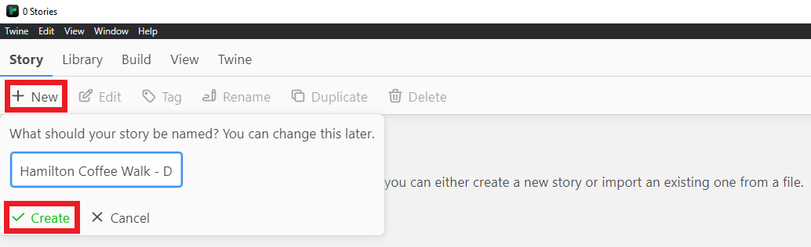 

Once you've created your new story, you'll be taken to the "Passages View". This is where you'll be creating your story.

## Setting our Story Format

Twine comes with several story formats that change the way that Twine works. Taken from the [Twine Cookbook](https://twinery.org/cookbook/starting/twine2/storyformat.html):

- **Harlowe** is the default story format, and is focused on making it easy to add basic interaction to your stories in a readable, concise way.
- **Snowman** is designed to be used by people who are familiar with writing JavaScript and CSS, two broadly-used Web technologies, and makes it easy to build a heavily-customized reading experience.
- **SugarCube** comes from the world of Twine 1. It gives readers the ability to save their progress into separate slots and provides a large collection of functionality for authors.
- **Chapbook** the first of a "second-generation" story formats, it is designed for newer users with advanced functionality built into its inserts and modifiers.

For this workshop, especially if you're watching this for Humanities 2DH3, make sure your story is set to the latest version of Harlowe.

- At the top left of your application window, click on `Story`.
- In the row below `Story`, click on the `Details` tab.
- At the bottom right, you'll see a new window with some details about your project. Set your Story Format to the latest version of Harlowe.
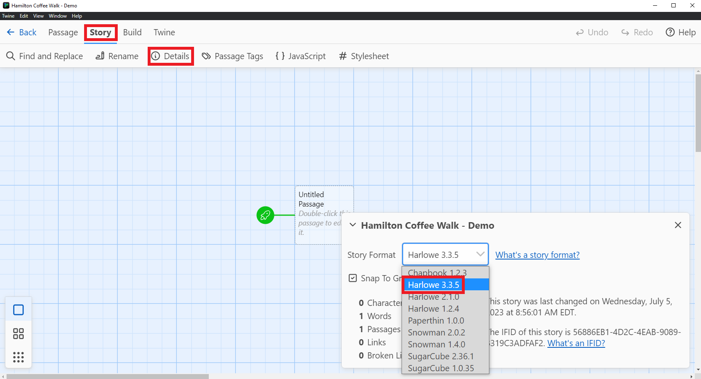 
- Close the details tab when you're done.

## Navigating the Passages View

When creating stories, you'll need more space than what's currently on your screen. Twine provides a few ways to change the position or size of your Passages View.

### Scrollbars
You can use the vertical and horizontal scrollbars to move your screen to other sections of the view.

### Zooming 
You can also zoom in and out. This will impact the user interface as well as the size of the Passages View.

- At the top left, in the `View` section, you'll see the `Zoom In` and `Zoom Out` options. You can click on them multiple times to zoom in and out even further.
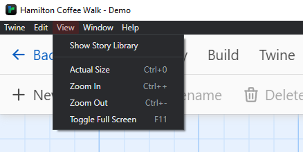 

### Story Views
Twine also provides three different "Story Views" that zoom the screen in and out depending on what information you want to see. 

  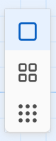 

  

  <b>Titles and Excerpts</b>  
  Used to view individual or small groups of tiles. Shows titles and some excerpt information
  

  

  <b>Passages Titles</b>  
  Used to view a cluster of tiles. Only shows titles.
  

  

  <b>Story Structure</b>  
  Used to view the structure of a story and the connections between passages.
  

## Writing your Story

Now that we've gotten all the setup and information out of the way, we can start creating our story!

In Twine, story "blocks" or "segments" are called "Passages". Each passage can have text, links to other passages, and visual customization. By default, Twine creates the first passage and calls it `Untitled Passage`.

- Double click on the `Untitled Passage` to edit the passage.
- Start creating a story and create some options for the player to choose from.
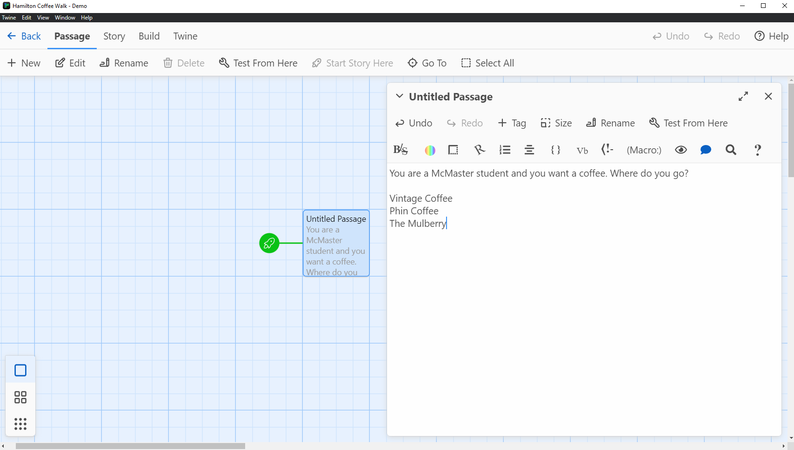

## Viewing your Story

Currently, you're writing your story in the coding end of Twine. To see what your players will see:

- Close the passage editing menu.
- In the `Passage` section, click on `Test from Here`.
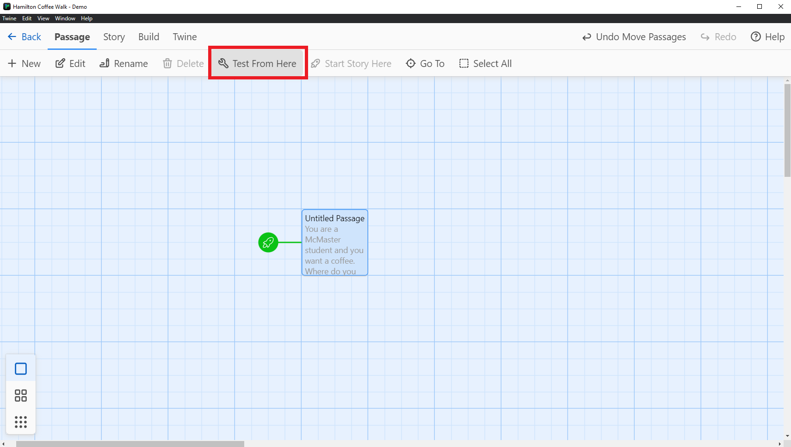

{: .note }
If your `Test from Here` button isn't working or is greyed out, make sure you have your passage selected. To select your passage, simply click once on it. 

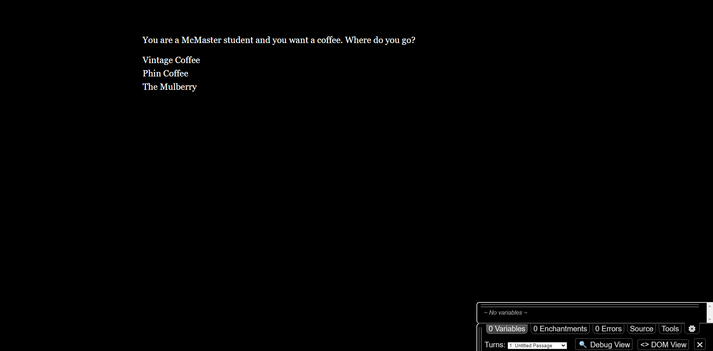

This will open up a new browser window with how your Twine story will look like to a user... mostly. You'll notice that there's a debug window at the bottom right of the page. This will allow you to debug and troubleshoot issues with your game. When you publish your game for others to see, your players will not have access to this window. Other than the debug window, this is exactly what your players will see.

## Creating Links to Passages

The whole point of Twine is that your players are able to interact with your story. Currently, the page is just plain text.

- Go back to the Twine application.
- To create a link to a new passage, surround your text with two square brackets [[ ]].
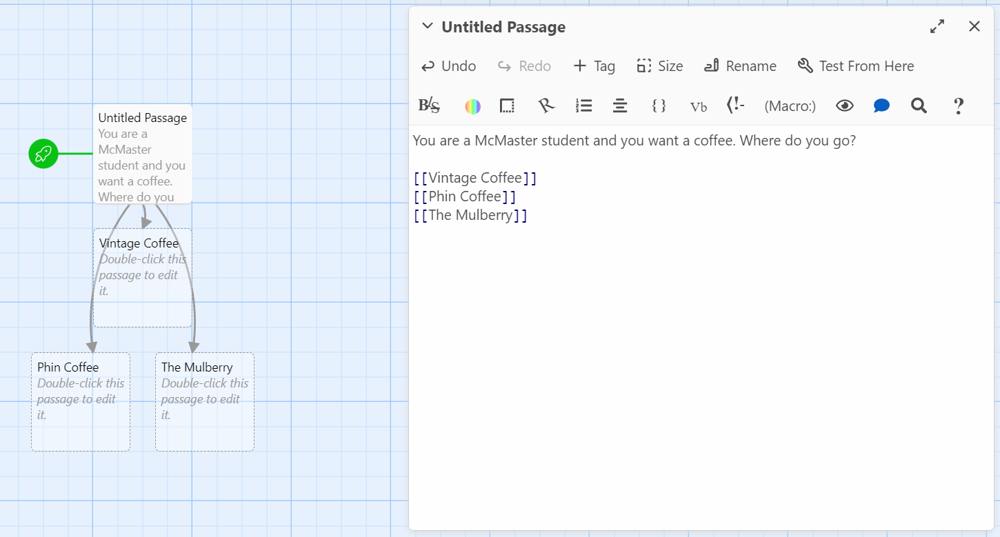

You'll start to notice a couple of things.

- The square brackets in the passage editing menu have been formatted differently, making them slightly bigger, more spaced out, and blue. This lets us know that Twine recognizes the text as a link.
- You'll also notice three new passages created. These new passages have arrows coming from the main passage we're editing. 

Now, when you test the game using `Test from Here`, you'll be able to click on your choices and it'll land you to a new page for that passage.

### Creating Links with Display Text

The new passages that Twine created have titles already. These titles are based on what you put inside the square brackets [[ ]].

Let's create a few more passages.

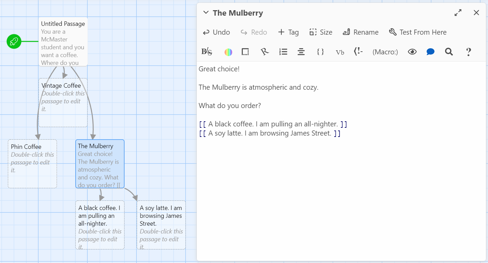

You'll notice that the titles start to get extremely long. What we can do instead is create a link that separates the display text from the location text.

- Create a new option for the player.
- Before surrounding it with square brackets [[ ]], add a pipe character \| at the end. This can usually be found above the `Enter` key on your keyboard.
- After the pipe, add a location name for your link.
- Finally, surround it with square brackets [[ ]]. See the image below for an example.
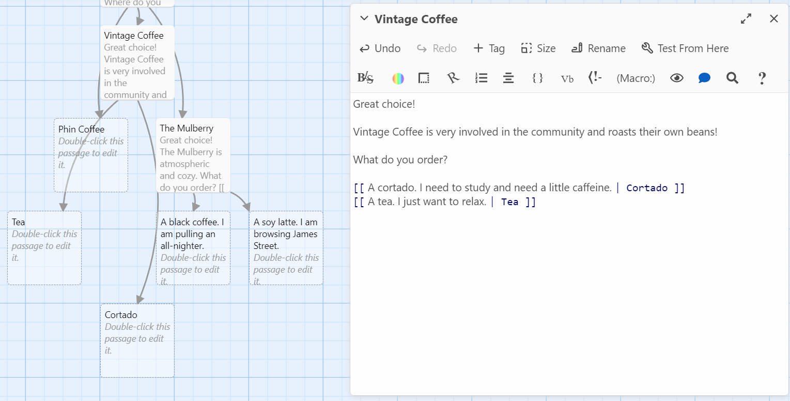

You can see that only the text after the pipe is formatted blue. The Vintage Coffee points to two new passages, Tea and Cortado. In the game, however, we instead see the display text show up for the options.

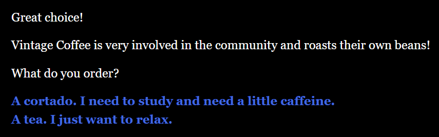

## Moving Passages

When Twine automatically creates your passages, it can get messy real quickly. You can move around passages by clicking and dragging them around the screen.

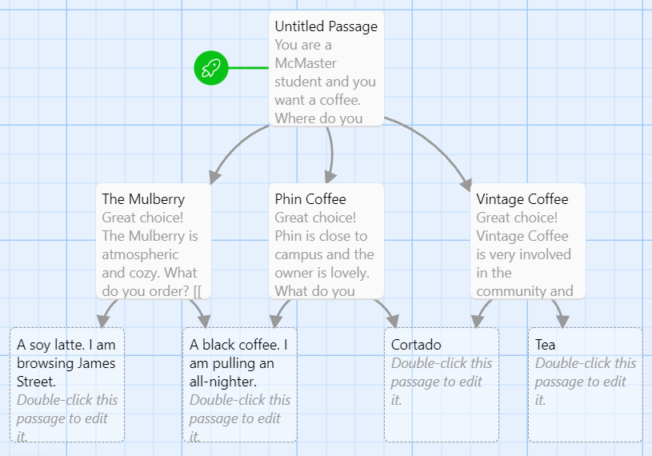

## Reusing Passages

If you have a passage that can be used by multiple passage links, you don't need to create duplicates for each passage that needs that link. You can simply refer to it by its title when creating the link.

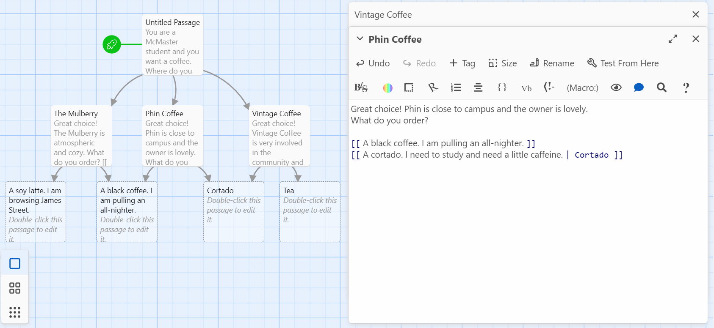

## Renaming a Passage

We can clean up the name of our `Untitled Passage` by renaming it.

- Select the `Untitled Passage` by clicking on it.
- Under the `Passage` section, click on `Rename` and give your passage a new name.
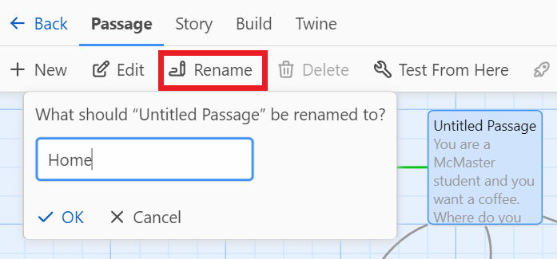

## Playing your Game

Let's wrap up the first lesson by playing the game without the debug window popping up.

- Go into the `Build` section and click on `Play`.
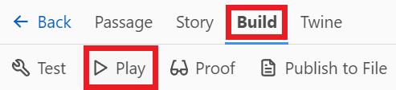

That's it! This will open up a new browser tab without the debug menu.

{: .warning}
If you want to share your game with your friends, you cannot simply give them that link. We'll talk more about this in [lesson 4](lesson4).

### Saving your Game as a File

If you'd rather have your game saved as a file so that you can play the game without opening Twine... 
- Click on the `Publish to File` button beside `Play`.
- Save the file as an HTML file (add a .html at the end of the file name) and save.
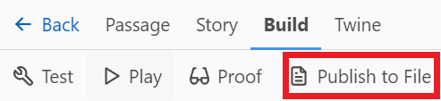

<!-- Summarize your learning objectives here. It acts as a reminder to the learner about what they just learned, as well as a checklist for you to make sure you covered everything you wished to cover. -->
## Key Points / Summary

- There are lots of ways to interact with your Twine story
- When linking passages, you can separate the display text from the title of the passage link
- It's important to frequently test your changes to prevent big issues from piling up

