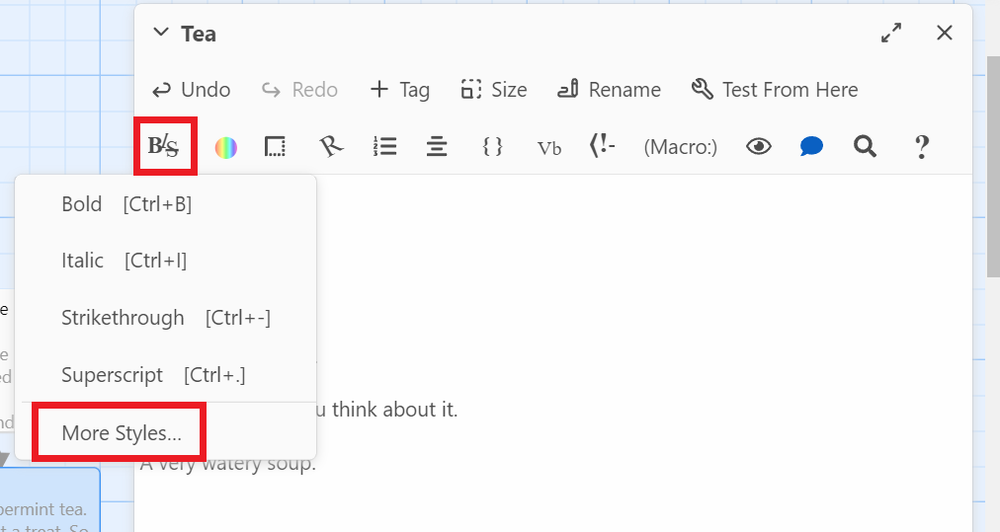
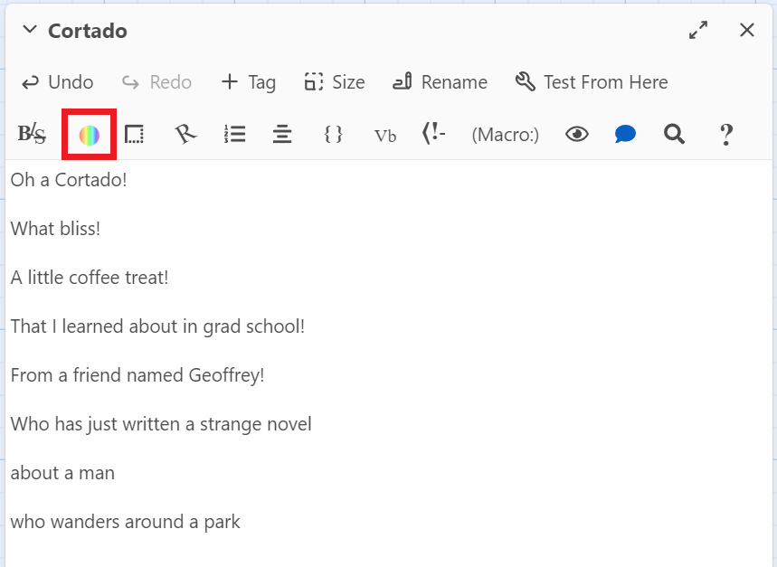

{: .no_toc}  
# Lesson 2 - Customizing the Appearance of Text on Twine

This lesson will cover some of the text customization options available in Twine, allowing you to make your stories look pretty.

  

    Table of Contents
  

  {: .text-delta }
- TOC
{:toc}

## Lesson Objectives
- Edit the format of our story's text

## Lesson Video
The following video demonstrates each of the steps outlined below in text.

<iframe height="416" width="100%" allowfullscreen frameborder=0 src="https://echo360.ca/media/58291217-e6cc-405a-9f56-71791a512c92/public"></iframe>
[View original here.](https://echo360.ca/media/58291217-e6cc-405a-9f56-71791a512c92/public)

## Text Styles
To apply some text styles to your text...
- Highlight the text you'd like to apply the styling to.
- Open up the `Styles` menu.
- Select the styling you'd like.  
 

If all went according to plan, your text should be formatted similarly to the style itself. It should also be surrounded by a symbol at the start and end. Those signify the text style, similarly to how square brackets [[ ]] signify a link, so they won't be seen in the game itself.

### Additional Text Styles
If bold, italic, strikethrough, and superscript aren't enough, there's an extra menu with a lot more options.
- Highlight the text you'd like to apply the styling to.
- Open up the `Styles` menu.
- Click on `More Styles`.  
 
- Create the text style you'd like and click `Add`.  
 

{: .note }
You can scroll down to see more options for the text styles.

There's lots of customization available in this menu, allowing for font variants, underlines, strikes, superscripts, subscripts, outlines, letter spacing, flips, stretches, and animations.

## Colours
If you'd like to change the font colour or the colour of the text background...
- Highlight the text you'd like to apply the colouring to.
- Open up the `Colours` menu.
 
- Select the styling you'd like.
 

There's a lot of customization here too, allowing for gradients and custom colour selection. Take some time to play around with these settings!

   
[Check out Geoffrey's novel here!](https://chbooks.com/Books/F/Falling-Hour)

## Borders
Twine also allows you to add borders to text.
- Highlight the text you'd like to apply the border to.
- Open up the `Borders` menu.

- Select the styling you'd like. 

Being able to modify each side of the border allows for some interesting possibilities.

 

## Rotated Text
You can also rotate text!
- Highlight the text you'd like to apply the rotation to.
- Open up the `Rotate text` menu.

- Select the styling you'd like. 

Rotating text may seem a little niche, but there's some really cool effects you can do with it.

 

## Lists
Bulleted and numbered lists are another thing you can make.
- Highlight the text you'd like to make a list item.
- Open up the `List and line items` menu.

- Select the list type you'd like. 

 

## Alignment and Columns
Finally, the last text formatting option we'll cover is alignment and columns.

### Alignment
- Highlight the text you'd like to change the alignment of.
- Open up the `Alignments and columns` menu and select `Alignment`.

- Adjust the placement and width of your text and select the text alignment.

### Columns
- Do **not** highlight any text. Select an empty area.
- Open up the `Alignments and columns` menu and select `Columns`.

- Adjust the number of columns and cell sizes.

- Move your text into the designated text area created for you.

Twine allows for in-depth positioning and column editing that's rarely found in other applications.

## Key Points / Summary

- There are many ways to customize text in Twine.
