{: .no_toc}  
# Lesson 3 - Customizing Your Twine Game with Code

In this third lesson, we'll be learning how to include links and images, change the font, and do several other things using code.

<details markdown="block">
  <summary>
    Table of Contents
  </summary>
  {: .text-delta }
- TOC
{:toc}
</details>

## Lesson Objectives
- Create links and images
- Change the font size and type
- Use code to change the background
- Learn about the "set" command

## Lesson Video
The following video demonstrates each of the steps outlined below in text.

<iframe height="416" width="100%" allowfullscreen frameborder=0 src="https://echo360.ca/media/1df5b5d4-65ad-49ed-b9f9-152987c665ac/public"></iframe>
[View original here.](https://echo360.ca/media/1df5b5d4-65ad-49ed-b9f9-152987c665ac/public)

## Twine Code Cheat Sheet

Throughout this lesson, we'll be referencing [this Twine Code Cheat Sheet](https://mcmasteru365-my.sharepoint.com/:w:/g/personal/littvs_mcmaster_ca/EUZxxT7qrPBPpqtEW6ULoUkBTCTT8tRZBhNkRbpeuPO06A?rtime=Qy8ejxp-20g).

You should keep it open in a new tab while working on your Twine game, as it'll come in handy often.

## Creating Links

While we've already created passage links, which links the player to another passage of the story, this time we'll be creating website links. You'll notice that if you simply copy and paste a URL into your passage, it'll just stay as plain text and it won't be clickable.

If you take a look at the Twine Code Cheat Sheet, the code to insert a link to a webpage is 

```html
<a href="URL">[text reader will see]</a>
``` 

Replace the `URL` with your website link, and replace the `text reader will see` with your display text (similar to how we had display text for passage links).

If you're familiar with some web development, you'll recognize that this looks a lot like HTML! That's because it is HTML. Twine adds some support for HTML, CSS, and JavaScript within the Twine editor.

<details markdown="1">
<summary>Creating a link in Twine example</summary>

<div class="code-example" markdown="1">
{: .label }
Input

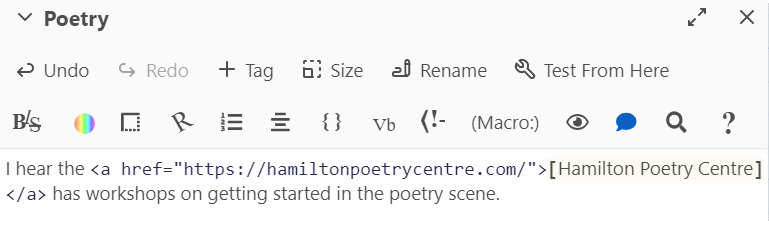 

{: .label .label-green }
Output

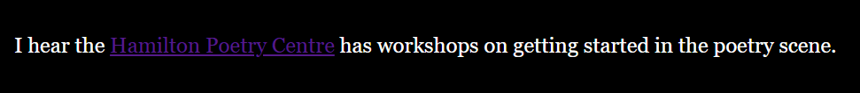 
</div>

{: .note}
The link is a bit hard to see because of the colours, but we'll be able to fix that up in the upcoming sections!

</details>

## Creating Pictures

Just like when we created a link, we need to pull up the cheat sheet to get the line of code for adding images.

```html

```

Replace the `URL OF IMAGE HERE` with your image URL. You can get an image URL by right clicking the image in a browser and clicking on `Copy image address`.

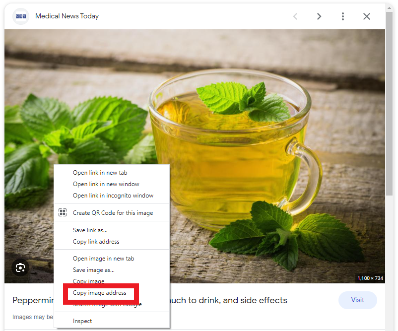 

{: .warning }
Note: There's currently no easy way to include local images in Twine. If possible, try to rely on images found on the web.

<details markdown="1">
<summary>Creating an image in Twine example</summary>

<div class="code-example" markdown="1">
{: .label }
Input

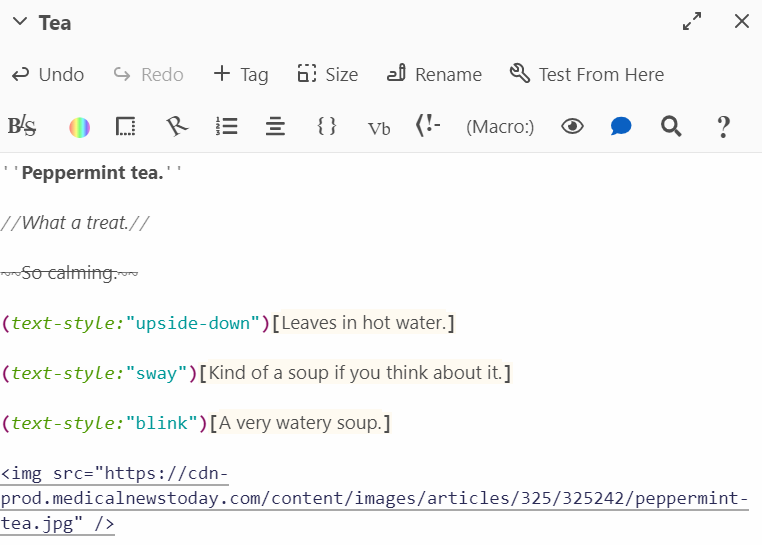 

{: .label .label-green }
Output

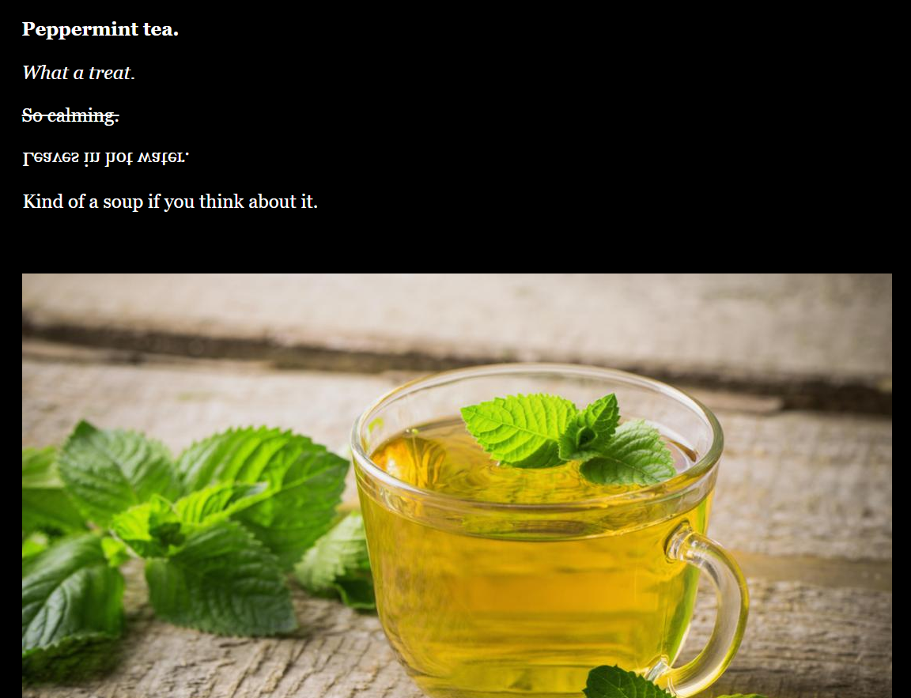 
</div>

</details>

## More Font Customization

We've done a bunch of font customization in the previous lesson, but there's even more that can be done using code.

### Changing the Font Size

Flipping back to the Twine cheat sheet, you should be able to find this line of code:

```markdown
(text-size:2)[text that will be new size]
```

This changes the font size of the text inside the square brackets [ ].

It's important to keep in mind that, by default, text-size is 1. A text-size of 2 is double the default size, whereas a text-size of 0.5 is half the default size.

<details markdown="1">
<summary>Resizing text in Twine example</summary>

<div class="code-example" markdown="1">
{: .label }
Input

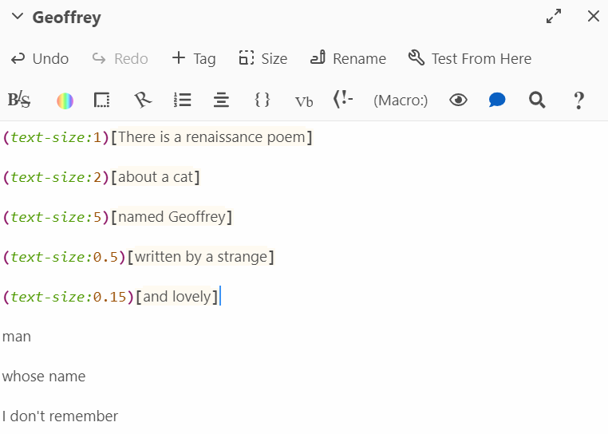 

{: .label .label-green }
Output

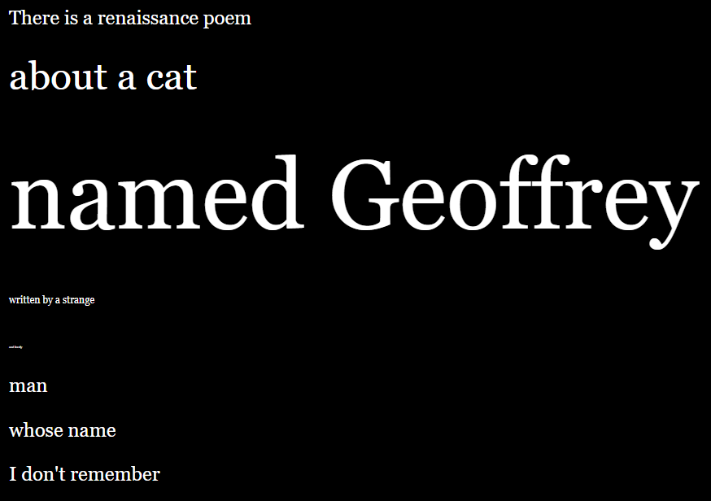 
</div>

</details>

### Changing the Font

By default, Twine uses <font style="font-family: Georgia">Georgia</font> for text. However, we can change that using this line of code:

```md
(font:'Font Name Here')[text reader will see]
```

This will only change the font for the text inside the square brackets.

Not all fonts are supported, but some that you can use include: 

- <font style="font-family: Georgia">Georgia</font>
- <font style="font-family: Arial">Arial</font>
- <p> <font style="font-family: Brush Script MT">Brush Script MT</font> (Brush Script MT) </p>
- <font style="font-family: Courier New">Courier New</font>
- <font style="font-family: Impact">Impact</font>
- <font style="font-family: Tahoma">Tahoma</font>
- <font style="font-family: Times New Roman">Times New Roman</font>
- <font style="font-family: Trebuchet MS">Trebuchet MS</font>
- <font style="font-family: Verdana">Verdana</font>

<details markdown="1">
<summary>Changing Font in Twine example</summary>

<div class="code-example" markdown="1">
{: .label }
Input

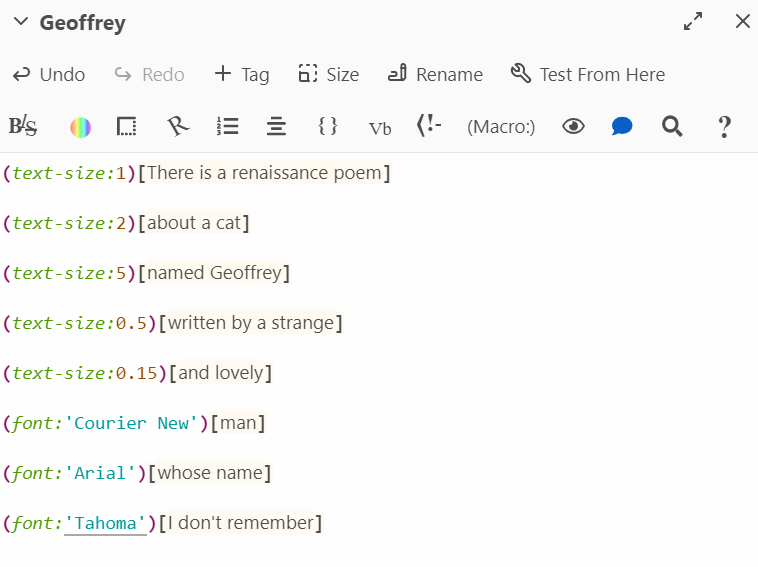 

{: .label .label-green }
Output

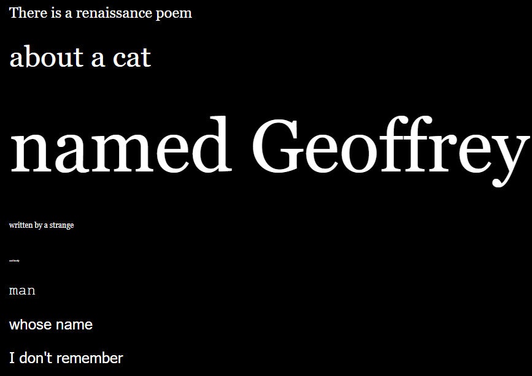 
</div>

</details>

## Changing the Background Colour

So far, all of our passages have had black backgrounds. We saw this be a small issue when we had a purple link, making it hard to see. 

Using "enchants", we can apply style changes to the backgrounds of our passages.

```md
(enchant: ?page, (background: COLOUR HERE))
```

Replace the `COLOUR HERE` with your desired colour.

<details markdown="1">
<summary>Changing the Background Colour in Twine example</summary>

<div class="code-example" markdown="1">
{: .label }
Input

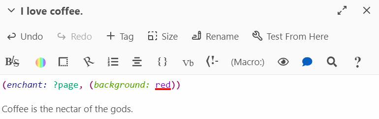 

{: .label .label-green }
Output

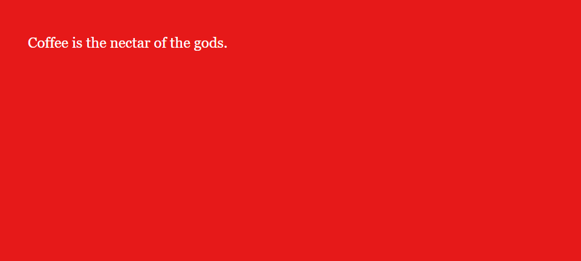 
</div>

</details>

There are additional settings that add more *pizzazz* to your background. You'll see that, in the cheat sheet, there's another line that adds coloured stripes in the background.

```md
(enchant: ?page, (background: (stripes: [angle number here], [stripe width number here], [colour name here], [colour name here])))
```

<details markdown="1">
<summary>Coloured Stripe Background in Twine example</summary>

<div class="code-example" markdown="1">
{: .label }
Input

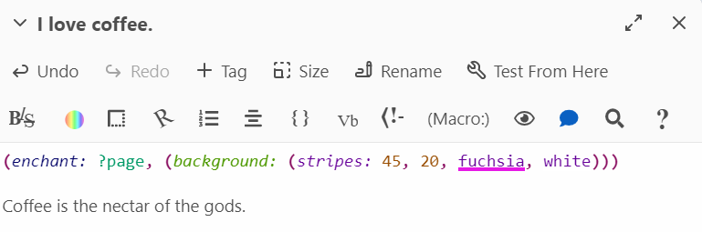 

{: .label .label-green }
Output

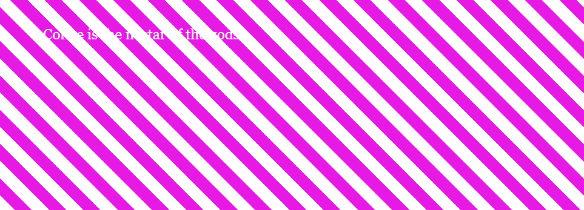 
</div>
</details>

## The Set Command

Twine allows for the use of variables. For those who don't know, a variable is a block of information with a name.

For example, when you start playing a new game, it might ask you for your name or username. You're given the opportunity to input your name, and then the game can use that name in the game.

What's actually happening is that your name is saved to a variable called "name". Whenever the game wants to use that name, they can refer to the "name" variable and substitute that information. If you're confused, that's okay! Hopefully, the example provided in this section will clear things up.

In Twine, we use the `set` command to create a variable, replacing `VARIABLENAME` with the variable name and `VALUE` with the value you wish to choose. 

```md
(set $VARIABLENAME to VALUE)
```

Twine also allows you to create prompts where the player has to input a value. If we put these two tools together, we can ask the player for their name.

```
(set $name to (prompt: "What is your name?", ""))
```

After the user answers the prompt, simply use `$name` to refer to it. Look at the example below to see it in action.

<details markdown="1">
<summary>Getting the Player's Name in Twine</summary>

{: .label }
Input

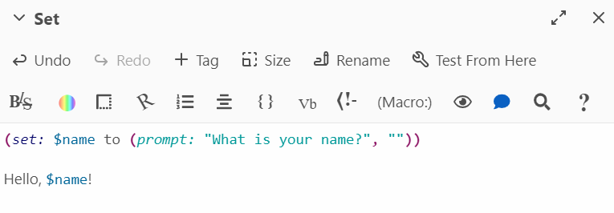 

{: .label .label-green }
Output

 

</details>

## Key Points / Summary

- We can have even more text and background customization using code!
- Prompts and variables are a nice way to personalize the story for users.
- Be sure to use the cheat sheet provided below!

## Additional Resources

- [Twine Code Cheat Sheet](https://mcmasteru365-my.sharepoint.com/:w:/g/personal/littvs_mcmaster_ca/EUZxxT7qrPBPpqtEW6ULoUkBTCTT8tRZBhNkRbpeuPO06A?rtime=Qy8ejxp-20g)