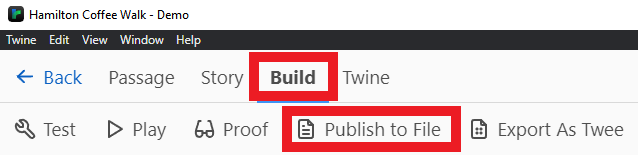
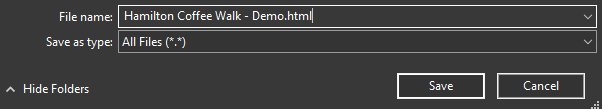
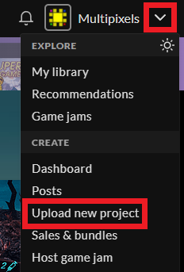
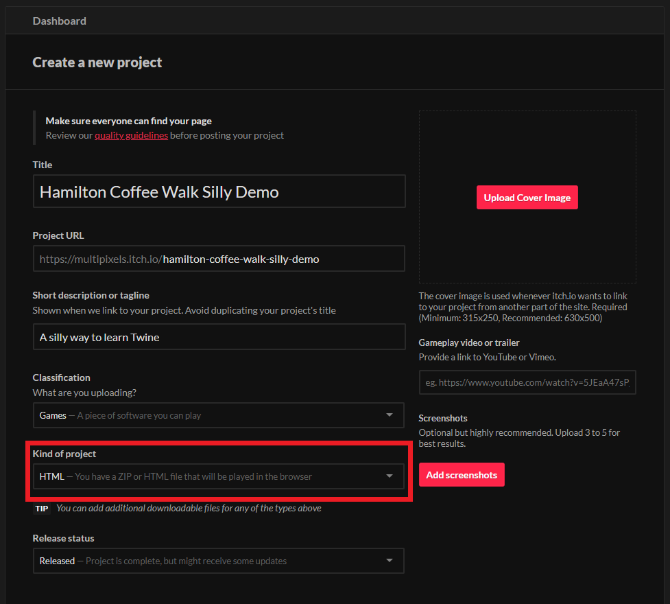
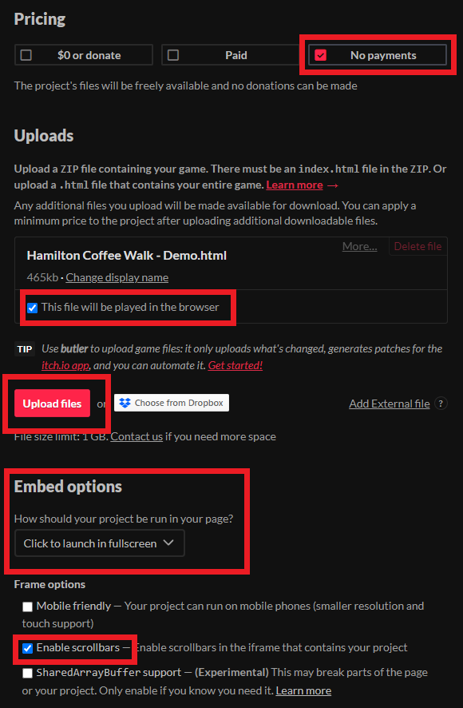
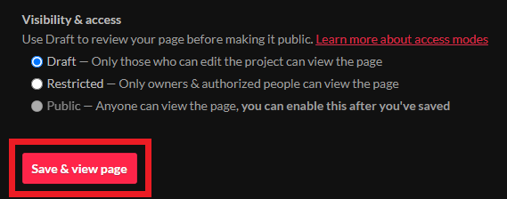

{: .no_toc}  
# Lesson 4 - Hosting Your Twine Game on itch.io

In this final lesson, we'll be publishing our game on [itch.io](https://itch.io), a marketplace primarily for indie creators.

  

    Table of Contents
  

  {: .text-delta }
- TOC
{:toc}

## Lesson Objectives
- Export your Twine game as a `.html` file
- Upload your game on [itch.io](https://itch.io)

## Lesson Video
The following video demonstrates each of the steps outlined below in text.

<iframe height="416" width="100%" allowfullscreen frameborder=0 src="https://echo360.ca/media/40f04344-4da6-4a53-a875-0afa34b30e24/public"></iframe>
[View original here.](https://echo360.ca/media/40f04344-4da6-4a53-a875-0afa34b30e24/public)

## What is itch.io?

[itch.io](https://itch.io) is an online open marketplace made for indie creators, making it easier for them to showcase their work to the public. While it's primarily for games, you can also find game assets, tools, music, board games, card games, comics, and books!

[itch.io](https://itch.io) also provides an easy way for us to share our Twine game with others. 

{: .note }
Games uploaded to [itch.io](https://itch.io) do not have to be made public. You can put a password on them or allow only people with the link to see and play your game page.

## Exporting your Twine Game

In order to upload our game to itch.io, we'll need to export our game as a .html file.

- If you don't already have your project opened, open it up now.
- Under the `Build` tab, click on `Publish to File`.
 
- Save your file as a ".html" file. If you're not able to select it, just make sure the file name ends with ".html".  

## Uploading your Twine Game on itch.io

If you haven't already, you must have an [itch.io](https://itch.io) account to be able to upload games.

- Register for or log into your [itch.io](https://itch.io) account.
- At the top right of your screen, open the drop-down menu and click on `Upload new project`.  

- Fill in the details for your game page.
  - For the `Kind of project` selection, make sure to pick `HTML`.  
  
  - Set your pricing to `No Payments`
  - Upload your game by clicking on the `Upload` button and selecting your ".html" file.
  - After the game finishes uploading, select "This file will be played in the browser"
  - For `Embed Options`, set it to `Click to launch in fullscreen`.
  - Finally, make sure to enable scrollbars. Passages sometimes get too long, so it's important for players to be able to scroll.  
  

You can mess around with the other settings yourself, like giving your game a description or tags. If you're planning to upload a game in the future, keep in mind that the visibility of your game will increase if you've got more details about the game.

When you're done with your game details, you'll need to select the access mode for your game. The first time you choose, it won't allow you to make your game public. This is to prevent accidental publishing.

To set your game to public, you'll need to click on `Save and view page` while it's in either Draft mode or Restricted mode.  

This will bring you to your new game page where you can test your game to make sure it's working.

Once you're ready to make your game public, click on `Edit game` at the top of the game page.  

You'll be brought back to the game dashboard page, where you should now be able to set your game to public!  

If you'd rather have your game be private, you can set your game to `Restricted` and set a password for access to the page. Setting your game to `Restricted` prevents it from being shown on your profile or on the [itch.io](https://itch.io) marketplace, requiring a direct URL to view the game.

## Key Points / Summary

- You can upload your Twine game to [itch.io](https://itch.io) to showcase it to the world.
