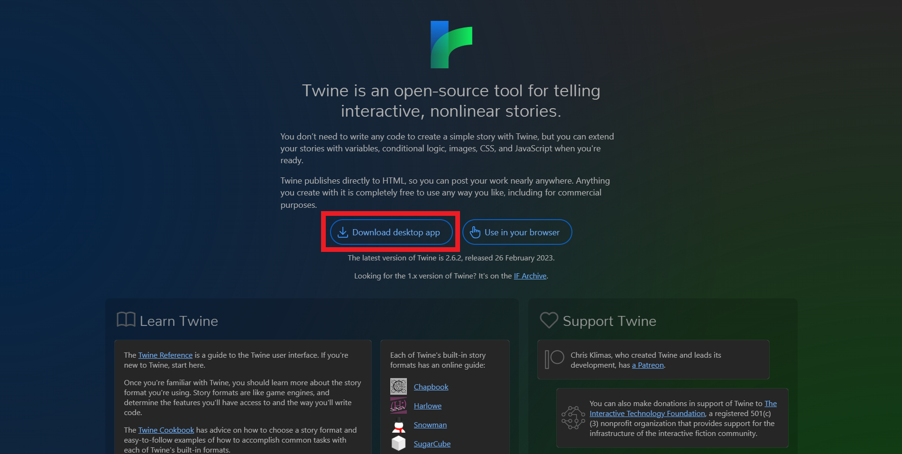
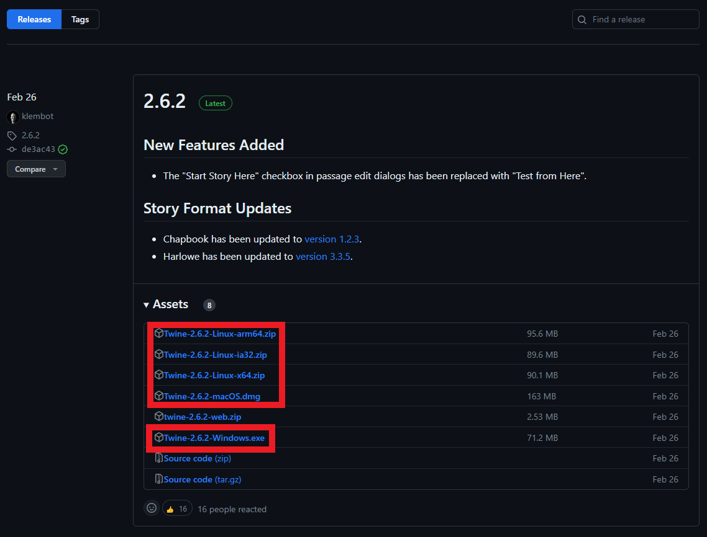
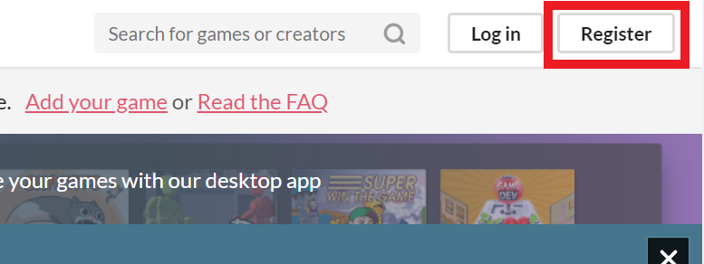

<!-- 
(OPTIONAL) This will be the page going over any installation or registration requirements.
Add, edit, or remove any content below for the workshop in question. 
-->

# Workshop preparation 

<!-- 
Seperate preparation into account creation, file downloads, and software downloads.
However, you can format this as you wish.
An example is provided below.
-->
## 1. Install Twine

<iframe height="416" width="100%" allowfullscreen frameborder=0 src="https://echo360.ca/media/10c31f36-35fa-4b72-8552-a23a51756755/public"></iframe>
[View original here.](https://echo360.ca/media/10c31f36-35fa-4b72-8552-a23a51756755/public)

Text Walkthrough

- Navigate to <https://twinery.org/>.
- Select `Download desktop app`. The desktop app of Twine has some additional features that aren't available in the browser version.

- Go to the latest release and download Twine for your operating system.

- Follow the instructions in the installation wizard.

## 2. Create an itch.io account

If you wish to publish your Twine game online, or if you'd like to share it with your friends, the easiest and best way is to use [itch.io](https://itch.io).

Text Walkthrough

- Navigate to [itch.io](https://itch.io).
- Click on the `Register` button at the top right of the page.

- After registering, sign in to your account.

